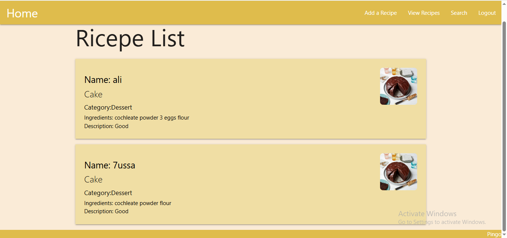
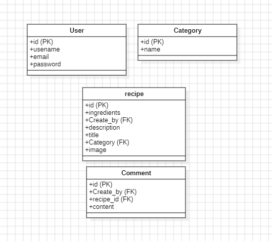

#  Recipe Sharing

## 🎨 Screenshots

## 📝 Description 
Recipe Sharing is a web app that you can share your recipe on it . It was built to make it easier for people to find, save, and share cooking recipes.

## ERD

## 🚀 Getting Started
Live App: 🌐 https://recipe-sharing-7122dcac85c6.herokuapp.com/

## ⚙️ Technologies Used
Frontend: [ HTML, CSS , python, Django Template Language]

Backend: [Django , python]

Database: [PostgreSQL]

## Attributions 
https://www.youtube.com/@BroCodez : A good developer that share tutorial for beginners , if you mis thing maybe he can help.

## 🎯 future enhancements
Step-by-step cooking mode

